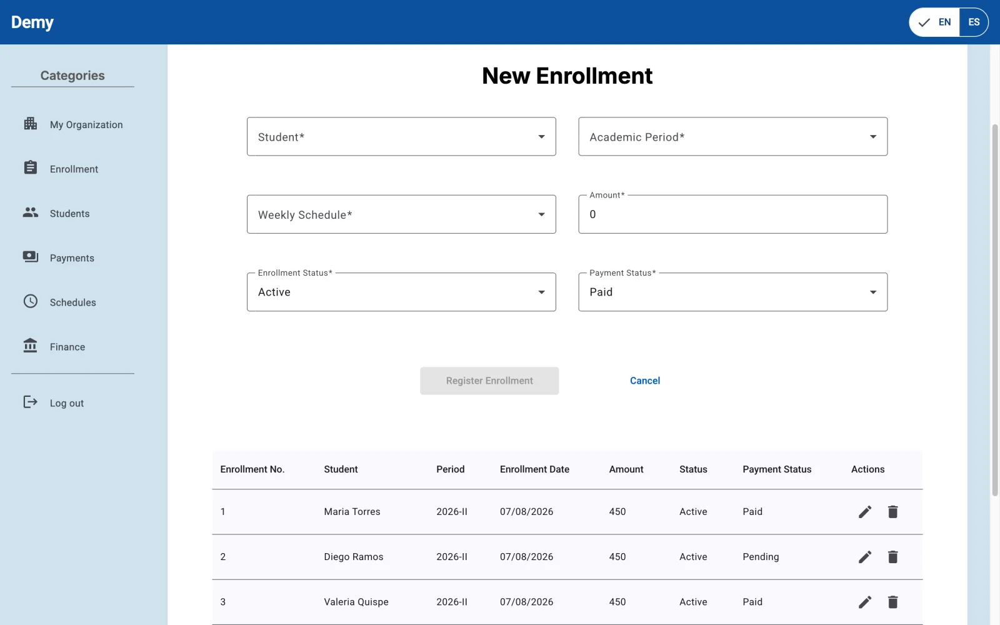

# Demy Web Application

Responsive **Demy** web application for managing academies and supporting teachers in their daily work. The SPA consumes `demy-web-service` and organizes its features around identity, enrollment, scheduling, attendance, and billing contexts.


## Role-based experiences

### Administrators

- Manage teachers, students, courses, classrooms, and academic periods.
- Create, search, update, and delete enrollments.
- Create weekly schedules and search schedule assignments.
- Assign invoices and register payments and expenses.
- Review the academy's financial transactions.

<table>
<tr>
<td width="50%"><br/><sub>Enrollment management</sub></td>
<td width="50%"><br/><sub>Expense registration and financial summary</sub></td>
</tr>
</table>

### Teachers

- Review the weekly schedule and reschedule classes.
- Record attendance by date and class session.
- Review attendance reports by student and date range.

<table>
<tr>
<td width="70%"><br/><sub>Attendance registration</sub></td>
<td width="30%"><br/><sub>Responsive weekly schedule</sub></td>
</tr>
</table>

## Architecture and technology

- Angular 19 with standalone components and Angular Router.
- Angular Material and responsive CSS.
- `@ngx-translate/core` with English and Spanish catalogs.
- Reactive forms, RxJS, and HTTP services grouped by bounded context.
- JWT authentication; active session and role data are stored in `localStorage`.
- Stripe.js for the subscription payment flow.
- Functional separation across `iam-user`, `enrollments`, `scheduling`, `attendance`, `billing`, and `shared`.

## Requirements

- Node.js 18.19 or newer.
- npm 9 or newer.
- A reachable [`demy-web-service`](https://github.com/smarteduhq/demy-web-service) instance.

## Local setup

1. Install dependencies:

   ```bash
   npm install
   ```

2. Open `src/environments/environment.development.ts` and set `apiBaseUrl` to the local backend URL, for example:

   ```ts
   apiBaseUrl: 'http://localhost:8090/api/v1'
   ```

3. Start the development server:

   ```bash
   npm start
   ```

4. Open [http://localhost:4200](http://localhost:4200).

Do not store credentials or private keys in environment files. A Stripe publishable key can be exposed by the client, but it must belong to the same environment configured by the backend.

## Scripts

| Command | Description |
|---|---|
| `npm start` | Starts the Angular development server. |
| `npm run build` | Creates the production bundle in `dist/demy-web-app/` and enforces the configured size budgets. |
| `npm run watch` | Rebuilds the development bundle when source files change. |
| `npm test` | Runs unit tests with Karma and Jasmine. |

## Demy ecosystem

- [`demy-landing-page`](https://github.com/smarteduhq/demy-landing-page): public product website.
- [`demy-web-service`](https://github.com/smarteduhq/demy-web-service): REST API consumed by this application.
- [`demy-report`](https://github.com/smarteduhq/demy-report): academic report and project traceability.

## License

This repository is distributed under the [MIT License](./LICENSE).
